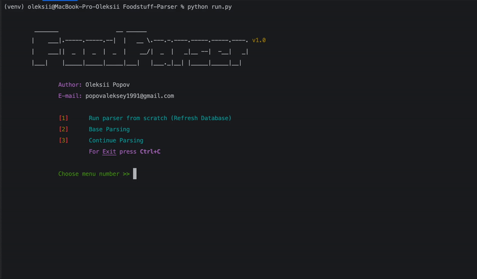

# Foodstuff-Parser
Script on Python for finding and parse the energy values of Ukrainian market foodstuffs. 
Also script founds another products of market.

## Grafana
In a root of project you can find Grafana config **grafana.json** for monitoring of process

